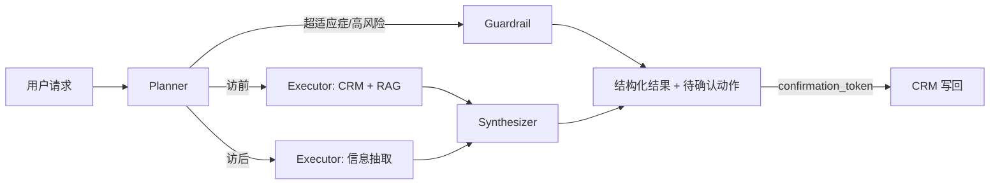

# SDD-02｜Agent 路由与工具契约

## LangGraph 状态机



## State Schema

```json
{
  "query": "string",
  "mode": "auto | pre | post",
  "route": "pre_visit | post_visit | customer_insight | material_recommendation | institution_access | capability_guide | guardrail",
  "plan": ["string"],
  "trace": [{"label": "string", "detail": "string", "state": "done | active | guarded"}],
  "context": "object",
  "evidence": "object",
  "extracted": "object",
  "suggested_action": "object",
  "sources": "array",
  "skill_id": "string",
  "skill_version": "string"
}
```

## Tool Contracts

| 工具 | 输入 | 输出 | 策略 |
| --- | --- | --- | --- |
| `read_customer_context` | 登录态注入的客户 ID | 客户、历史拜访、观念阶梯、待办 | 只读、权限先行 |
| `retrieve_approved_evidence` | 改写后的医学问题 | 文档、版本、审批、定位 | 仅返回有效已批准资料 |
| `read_institution_status` | 医院 ID、产品线 | 目录、覆盖、风险 | 不得从模型记忆生成 |
| `read_detail_aids` | 产品线 | 面对面拜访电子手卡（已审批） | 只读、仅审批通过版本 |
| `extract_visit_record` | 访后口语记录 | 观念阶梯变化、下次拜访、兴趣点 | 模型抽取，规则兜底 |
| `detect_pii` | 访后口语记录 | 患者隐私片段（姓名/住址） | 确定性红线，命中即脱敏 |
| `detect_off_label` | 访后口语记录 | 超适应症命中项 | 确定性红线，命中即拦截 |
| `optional_tavily_search` | 用户明确要求的公开背景查询 | 外部公开结果 | 不得成为医学结论依据 |
| `calculate_bonus` | target、achieved、policy ID | amount、阶梯、政策版本 | 确定性服务 |
| `confirm_visit` | confirmation token、参数快照 | visit ID、task ID | 幂等/人工确认 |

## 模型职责边界（更新）

配置 `AI_PROVIDER=deepseek` 且提供 key 时，模型参与三件事：意图路由分类、访后口语的结构化抽取、以及基于工具已取回数据的自然语言组织（含真 token 流式）。但事实、医学引用、机构数据、奖金金额、以及隐私/超适应症红线判定，均由确定性工具决定，模型输出经后端白名单校验后才使用。无 key 时全部降级为规则实现，Demo 仍可运行。

## 异常与降级

- 没有模型 Key：`AI_PROVIDER=local`，LangGraph 继续使用真实工具与规则节点完成完整任务链。
- 配置 `AI_PROVIDER=deepseek`：意图分类、抽取与回复可调用 DeepSeek；网络、配额或结构异常自动降级到本地回复。
- 工具/资料无证据：不生成医学结论，提示转医学团队。
- Tavily 未配置或不可用：显示工具降级状态，不影响 CRM、知识库和写回链路。
- 流式接口仅传递同一次任务的 Planner、工具轨迹与最终受控答复；连接中断不改变任何 CRM 数据。
